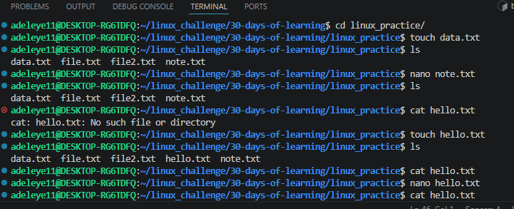
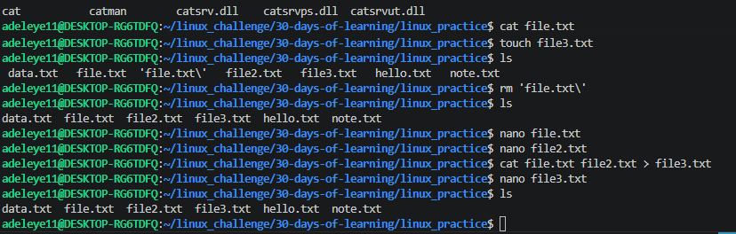

# Day 03 - Editing and Viewing Files

## Objective
The goal for today was to learn how to view and edit files in Linux using command-line tools. This included understanding how to read file contents, create files, and modify them using terminal-based editors.

## What I Learned

How to create a new empty file using the touch command
How to create mulitiple files at once using a single command
How to open and edit files using the nano text editor
How to view the contents of files using the cat command
How to combine files and redirect output into a new file

## What I Built / Practiced
Created and edited files using these commands:

touch hello.txt
touch file1 file2 file3
nano notes.txt
nao hello.txt

Viewing file contents:

cat hello.txt, cat file1.txt, file2.txt

Combining files into a new file:

cat file1 file2 > file3

## Challenges Faced

I had difficulties exiting the nano editor which i later figured out with the use of AI
I needed to remember the keyboard shortcuts for saving and closing files 

## Key Takeaways

The touch command is useful for quickly creating files
nano is a simple to use as its a beginner friendly text editor in Linux
cat can display file contents and can also combine contents of two files into a new one

## Resources

https://github.com/Najeeb-Sulaiman/linux-and-bash-scripting-guide/blob/main/02-linux-commands/02-editing-and-viewing-files.md

## Output

 
