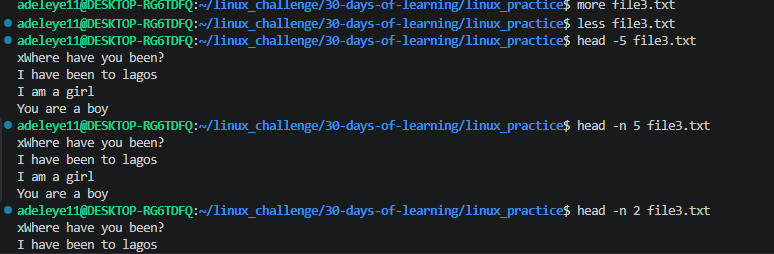
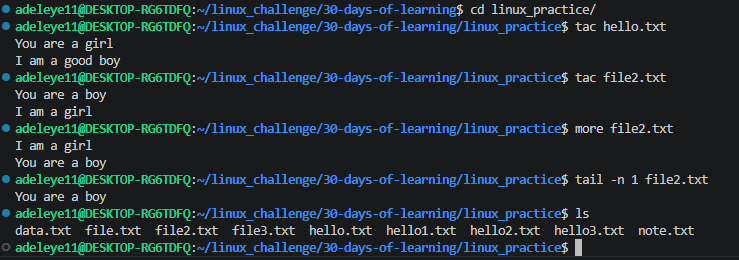

# Day 04 - [Continuation of Editing and viewing files]

## Objective

What was the goal for today?
The goal for today was to continue learning how to view and edit files in Linux using command-line tools. This included understanding how to read file contents, create files, and modify them using terminal-based editors.
---

## What I Learned

I learnt that:
Tac -  is used to display file content in reverse order
More -  is used to view long files and one page at a time
Less -  is used to scroll through a file interactively 
head -n 3 - this enables to show the first 3 lines of a file
tail -n 5 - this enables to show the last lines of a file
tail -f is used to continiously monitor file changes(e.g logs)

## What I Built / Practiced

tac hello.txt
  more file3.txt
  nano file3.txt
  more file3.txt
   less file3.txt
   head -5 file3.txt
   head -n 5 file3.txt
   tail -n 2 file3.txt
   locate file3.txt

## Challenges Faced

The challenges i faced was when i used less file3.txt i didnt know how to exit which is pressing the q on the keyboard to exit which i had to do research on it. Also was curious on what locate file3.txt will do i had to give a try which asked me to download with sudo app install plocate which i did. 

## Key Takeaways

Using the head -n 5 and tail -n 2 is a good way to show fewer numbers of lines in a file.
also using tac is a very good way to show what content is in a file

## Resources

https://github.com/Najeeb-Sulaiman/linux-and-bash-scripting-guide/blob/main/02-linux-commands/02-editing-and-viewing-files.md

## Output

  