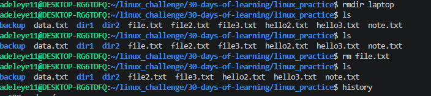

# Day 05 - [Manipulate Files and Directory]

## Objective

What was the goal for today?

My goal for today was to learn how to manipulate Files and Directory in linux, trying to understand how files can be move from one files to another, how to copy a file to a directory and still retain the content in the previous file. 

## What I Learned

I learnt how to copy a file to another file still retaining the content in the previous file.
I learnt how to Copy a directory and its contents recursively
I learnt how to move a move or rename a file/directory
I learnt how to name a directory and also remove an empty directory
I learnt how to delete a file 

## What I Built / Practiced

 cp file3.txt backup/
 mkdir backup
 cp file3.txt backup/
 cp -r dir1 dir2
 mkdir dir1 dir2  
 cp -r dir1 dir2
 mv hello1.txt hello2.txt
 mv hello.txt hello2.txt
 mkdir laptop
 rdmir laptop
 rmdir laptop
 rm file.txt
 

## Challenges Faced

The challenges i faced was moving a file to another file thinking i will still have the previous file but didnt work that way, it actually deleted the previous file .This makes me know the difference between copy and mv 
mv = Move (Rename or relocate; original is gone)
cp = Copy (Duplicate; original stays)

## Key Takeaways

Using these linus commands is actually a very good way of making a directory, file, moving from one file to another also copying. I actually learnt alot especially knowing the differences between copy and move.

## Resources

https://www.geeksforgeeks.org/
https://github.com/Najeeb-Sulaiman/linux-and-bash-scripting-guide/blob/main/02-linux-commands/03-manipulate-files-and-directory.md

## Output

