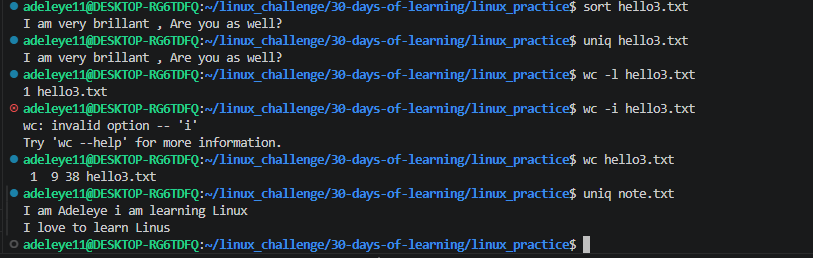
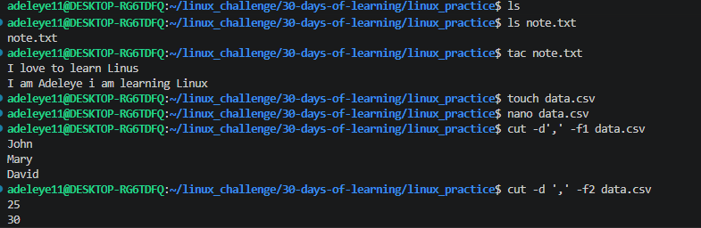
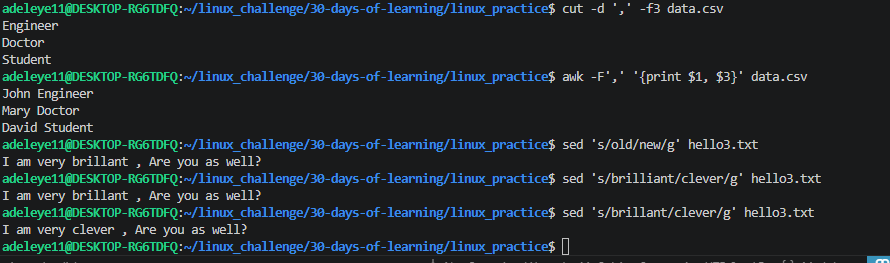

# Day 07 - [Sorting, Counting, and Filtering Data]

## Objective

What was the goal for today?

The goal for today was to learn how to sort. count and filter in Linus using powerful text processing commands 

## What I Learned

How to sort lines in a file alphabetically using sort.
How to remove duplicate lines using uniq.
How to count lines, words, and characters using wc.
How to extract specific columns from files using cut.
How to process and analyze text using awk.
How to search and replace text using sed

## What I Built / Practiced

 Sorted text files using:
 sort hello3.txt

Removed duplicate entries:
 uniq hello3.txt
 uniq note.txt

Removed duplicate entries:
 wc -l hello3.txt
 wc -i hello3.txt
 wc hello3.txt
 
Counted lines in a file:
 cut -d',' -f1 data.csv         
 cut -d ',' -f2 data.csv
 cut -d ',' -f3 data.csv

Extracted specific columns from a CSV file:
 awk -F',' '{print $1, $3}' data.csv

Replaced text using sed:
 sed 's/old/new/g' hello3.txt
 sed 's/brilliant/clever/g' hello3.txt
 sed 's/brillant/clever/g' hello3.txt

## Challenges Faced

There are lot of challenges especially understanding what each commands does i have to do lots of research.
In some cases where i created a file name data.csv i had to create a small dataset inside it to be able to understand the command i want to use it with. 

## Key Takeaways
Linux provides powerful built-in tools for text processing.
Understanding Commands like awk, sed, and cut are widely used for data analytics , data engineering
Combining commands with pipes allows advanced data filtering and transformation.

## Resources
https://github.com/Najeeb-Sulaiman/linux-and-bash-scripting-guide/blob/main/02-linux-commands/05-sorting-counting-and-filtering-data.md

## Output

   

 
 sort hello3.txt
 uniq hello3.txt
 wc -l hello3.txt
 wc -i hello3.txt
 wc hello3.txt
 uniq note.txt
 cut -d',' -f1 data.csv         
 cut -d ',' -f2 data.csv
 cut -d ',' -f3 data.csv
 awk -F',' '{print $1, $3}' data.csv
 sed 's/old/new/g' hello3.txt
 sed 's/brilliant/clever/g' hello3.txt
 sed 's/brillant/clever/g' hello3.txt
