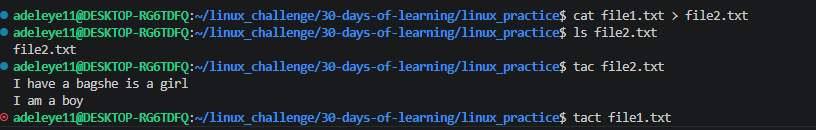
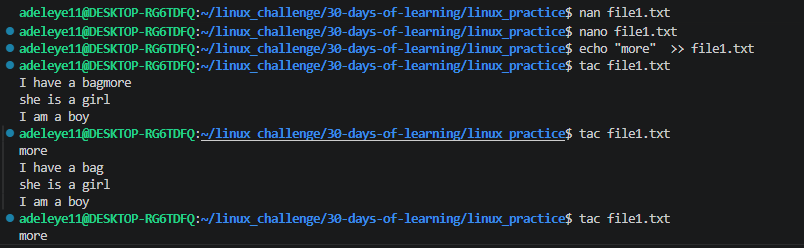

# Day 08 - [Redirection and Pipes]

## Objective

What was the goal for today?

The goal for today was to learn redirection and Pipes and to understand how Linux commands use input and output streams and how to control them using redirection operators and pipes.

## What I Learned

. Linus commands use three main data streams: stdin (input) stdout (output), and stderr (error output)

. > redirects output to a file and overwrites the file

. >> appends output to the end of a file without deleting existing content

. Using < tells the command to read the input from a file.

. | (pipe) sends the output of one command directly into another command.

## What I Built / Practiced

Redirecting output to another file:
 cat file1.txt > file2.txt
 cat file1.txt > file2.txt
 cat file1.txt > file4.txt
 cat note.txt > book.txt 

Using pipes to filter data:
  echo "more"  >> file.txt
  echo "more"  >> file1.txt
  echo "what is your name" >> note.txt
 
Reading input from a file:
   sort < file1.txt
   sort < file1.txt > sorted_file.txt
   sort < sorted_file.txt
   sort < note.txt

Using pipes to filter data:
 cat note.txt | grep "learn"
 cat file1.txt | grep "error"

## Challenges Faced

Understanding the difference between overwriting (>) and appending (>>) files.
Learning how pipes connect multiple commands together.

I was comparing cat to cp, i later realize that when you do cat it overwrites the content in the first file to the second file.

## Key Takeaways

Redirection allows saving command outputs into files.

Pipes allow commands to work together by passing data between them.

These features make Linux very powerful for automation, scripting, and data processing.

## Resources

https://github.com/Najeeb-Sulaiman/linux-and-bash-scripting-guide/blob/main/02-linux-commands/06-redirection-and-pipes.md

## Output
 

 cat file1.txt > file2.txt
 cat file1.txt > file2.txt
 cat file1.txt > file4.txt
 cat note.txt > book.txt 
  echo "more"  >> file.txt
  echo "more"  >> file1.txt
  echo "what is your name" >> note.txt
  sort < file1.txt
   sort < file1.txt > sorted_file.txt
   sort < sorted_file.txt
   sort < note.txt
   cat note.txt | grep "learn"
   cat file1.txt | grep "error"