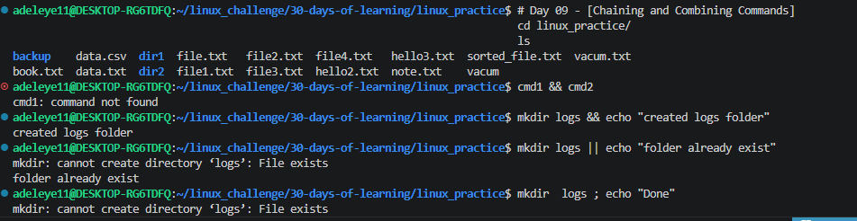
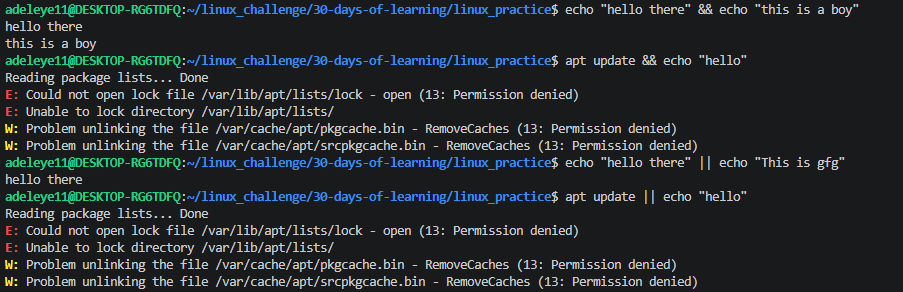

# Day 09 - [Chaining and Combining Commands]

## Objective

What was the goal for today?

The goal for today was to learn how to chain multiple Linux commands together and control their execution using operators like &&, ||, and ;

## What I Learned
&& runs the next command only if the previous command succeeds.

|| runs the next command only if the previous command fails.

; runs commands sequentially regardless of success or failure.

Chaining commands helps automate workflows and improves efficiency.

Combining chaining with pipes and redirection makes Linux very powerful.

## What I Built / Practiced

Creating a directory and confirming success:

mkdir logs && echo "Created logs folder"

Handling errors when a directory already exists:

mkdir logs || echo "Folder already exists"

Running commands sequentially:

mkdir test ; echo "Done creating test folder"

Combining chaining with navigation:

mkdir project && cd project

   echo "hello there" && "this is a boy"

   echo "hello there" && echo "this is a boy"

   apt update && echo "hello"

   echo "hello there" || echo "This is gfg"

   apt update || echo "hello"

## Challenges Faced

The first challenged was actually trying to understand the concept.

Understanding when to use && vs ||.

Learning how command success or failure affects execution.

Trying to locate where the pip symbol is on my keyboard

## Key Takeaways

&& It is helpful when we want to execute a command if the first command has executed successfully.

|| is useful for error handling.

; ensures commands run no matter what.

Command chaining is essential for automation and scripting in Linux.

## Resources

https://github.com/Najeeb-Sulaiman/linux-and-bash-scripting-guide/blob/main/02-linux-commands/07-chaining-and-combining-commands.md

https://www.geeksforgeeks.org/linux-unix/chaining-commands-in-linux/

## Output

 

   cmd1 && cmd2
   mkdir logs && echo "created logs folder"
   mkdir logs || echo "folder already exist"
   mkdir  logs ; echo "Done"
   mkdir project && cd project || echo "Could not create project"
   echo "hello there" && "this is a boy"
   echo "hello there" && echo "this is a boy"
   apt update && echo "hello"
   echo "hello there" || echo "This is gfg"
   apt update || echo "hello"
 