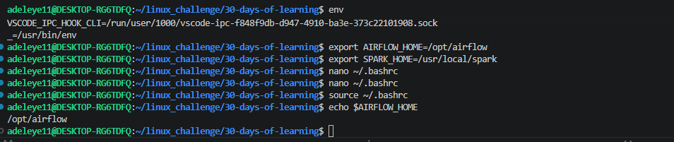
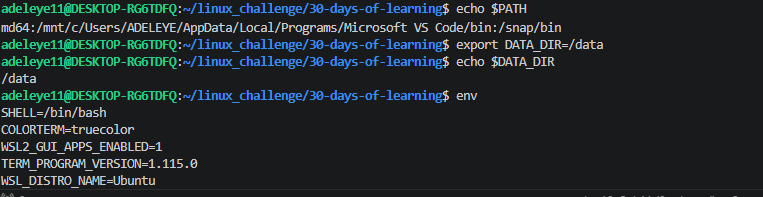

# Day 10 - [Environment Variables]

## Objective

What was the goal for today?

The goal for today was to understand environment variables in Linux, how they store system or user-specific settings, and how to create and use them in the terminal.

## What I Learned

Environment variables store configuration values used by the system and applications.

echo $PATH shows the directories where Linux looks for executable commands.

export VAR=value is used to create a new environment variable.

env displays all environment variables currently set in the system.

Environment variables can be used to simplify long paths and configurations.

## What I Built / Practiced

Viewing system path:

echo $PATH

Creating and using environment variables:

export DATA_DIR=/data
echo $DATA_DIR

Listing all environment variables:

env

Setting application paths:

export AIRFLOW_HOME=/opt/airflow
export SPARK_HOME=/usr/local/spark

Using variables:

cd $AIRFLOW_HOME

## Challenges Faced

Understanding how environment variables work temporarily.

Learning how to reference variables using $.

I was confused when i saw some files inside nano ~/.bashrc  , I had to paste export AIRFLOW_HOME=/opt/airflow
 
export SPARK_HOME=/usr/local/spark at the end of the files to be able to do a quick test echo $AIRFLOW_HOME to 

confirm /opt/airflow

## Key Takeaways

Environment variables help manage system configurations efficiently.

They make commands shorter and easier to use.

Variables created with export are temporary unless saved in configuration files like .bashrc.

## Resources

https://github.com/Najeeb-Sulaiman/linux-and-bash-scripting-guide/blob/main/02-linux-commands/08-environment-variables.md

## Output

  

 echo $PATH
 export DATA_DIR=/data
 echo $DATA_DIR
 env
 export AIRFLOW_HOME=/opt/airflow
 export SPARK_HOME=/usr/local/spark
 nano ~/.bashrc
 source ~/.bashrc
 echo $AIRFLOW_HOME
  