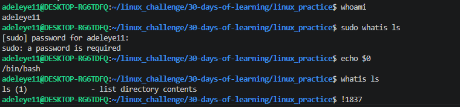

# Day 11 - [Linux Tips and Command Shortcuts]

## Objective

What was the goal for today?

The goal for today was to understand environment variables in Linux, how they store system or user-specific settings, and how to create and use them in the terminal.

## What I Learned

whoami shows the current logged-in user in the terminal.

echo $0 displays the shell being used to run commands.

/ is used to separate directories in Linux paths.

Linux is case-sensitive, meaning File.txt and file.txt are different.

whatis provides a quick description of a command.

Up and down arrow keys are used to navigate previous commands.

TAB key is used for auto-completion of commands and file names.

history shows a list of previously executed commands.

!n re-runs a specific command from history (where n is the command number).

sudo !! repeats the previous command with administrative privileges.

## What I Built / Practiced

Checking current user:

whoami

Checking current shell:

echo $0

Getting command description:

whatis ls

Viewing command history:

history

Re-running a command:

!2
!1837

Running previous command with sudo:

sudo !!

## Challenges Faced

Remembering how command history indexing works.

Understanding when to use sudo !! safely.

Had issues using  !2 until i check history to find i was in 1837, then i did  !1837

## Key Takeaways

Linux has many built-in shortcuts that improve productivity.

Command history can save time when repeating tasks.

Autocompletion and shortcuts reduce typing errors.

Understanding system users and shells helps in troubleshooting.

## Resources

https://github.com/Najeeb-Sulaiman/linux-and-bash-scripting-guide/blob/main/02-linux-commands/09-linux-command-tips.md

## Output

whoami
echo $0
whatis ls
sudo whatis ls
history
whoami
history
!2
!1837