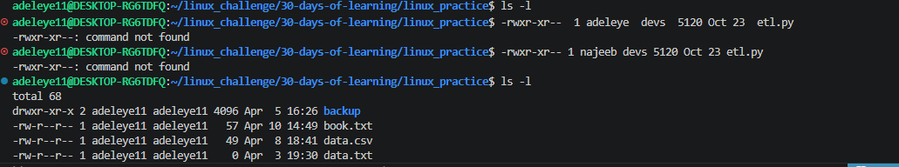
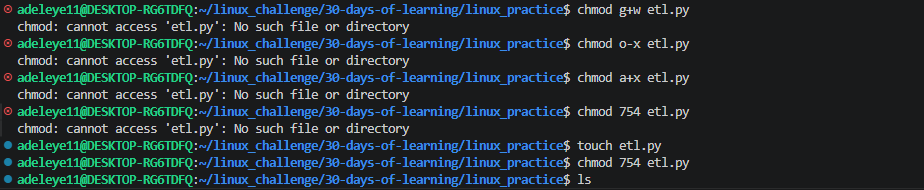
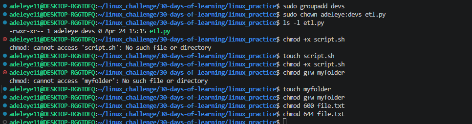

# Day 13 - [File Permissions and Ownership]

## Objective

What was the goal for today?

The goal for today was to understand how Linux controls access to files and directories using permissions and ownership, and how to manage them using chmod and chown.

## What I Learned

Linux uses permissions to control access to files and directories.

There are three types of users:

User (owner)

Group

Others

There are three types of permissions:

r (read) – view content or list directory

w (write) – modify content or create/delete files

x (execute) – run files or enter directories

ls -l is used to view file permissions.

chmod changes file permissions.

chown changes file ownership.

Groups must exist before assigning them to files.

## What I Built / Practiced

Viewing permissions:

ls -l

Making a file executable:

chmod +x script.sh

Changing permissions using numeric mode:

chmod 754 etl.py

Changing ownership:

sudo chown adeleye11:devs etl.py

Creating a group (if needed):

sudo groupadd devs

## Challenges Faced

Files not found when trying to apply permissions.

Errors due to incorrect group names.

Confusion between symbolic and numeric permission modes.

Not creating a file before excuting a command

Trying to understand what i was going to do was bit difficult 

## Key Takeaways

Permissions control security in Linux systems.

chmod and chown are essential for managing file access.

Always confirm file existence using ls before running commands.

Groups must exist before assigning ownership.

Small syntax errors can break commands.

## Resources

https://www.geeksforgeeks.org/linux-unix/file-permission-and-ownership-commands-in-linux/

https://github.com/Najeeb-Sulaiman/linux-and-bash-scripting-guide/blob/main/04-linux-file-permissions-and-ownership/01-file-permissions-and-ownership.md

## Output

   

 ls -l
 -rwxr-xr--  1 adeleye  devs  5120 Oct 23  etl.py
 -rwxr-xr-- 1 najeeb devs 5120 Oct 23 etl.py
 ls -l
 chmod g+w etl.py
 chmod o-x etl.py
 chmod a+x etl.py
 chmod 754 etl.py
 touch etl.py
 chmod 754 etl.py
 sudo chown adeleye  etl.py
 sudo chown adeleye :devs etl.py
 sudo chown adeleye:devs etl.py
 sudo groupadd devs
 sudo chown adeleye:devs etl.py
 ls -l etl.py
 chmod +x script.sh
 touch script.sh
 chmod +x script.sh
 chmod g+w myfolder
 touch myfolder
 chmod g+w myfolder
 chmod 600 file.txt
 chmod 644 file.txt

